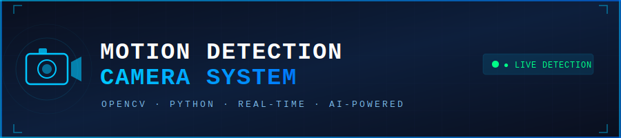
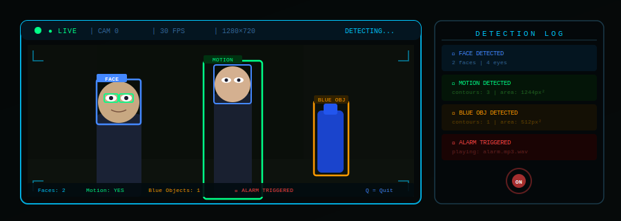
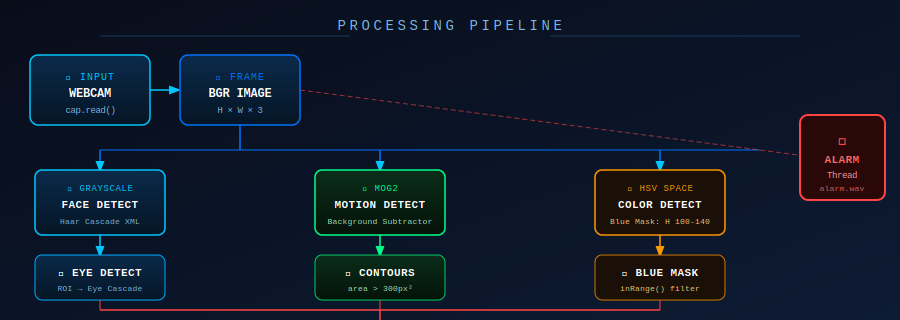
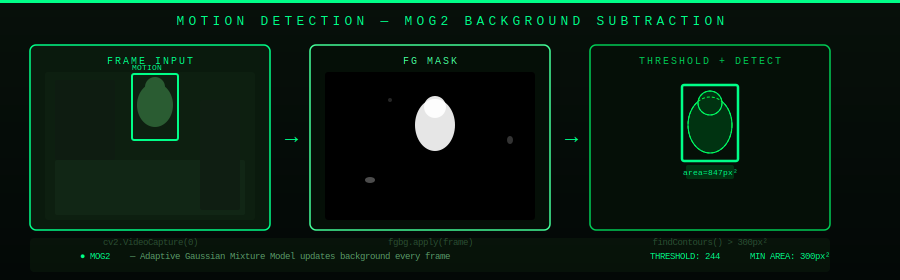
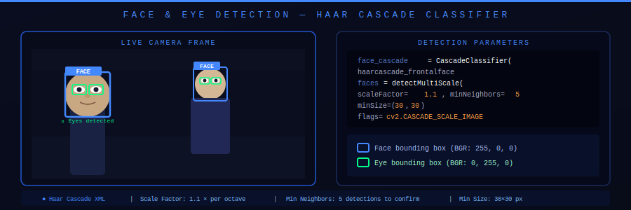
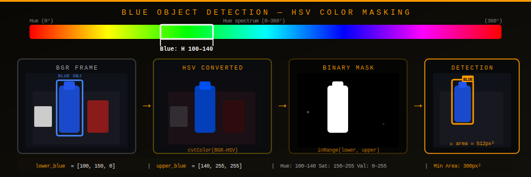
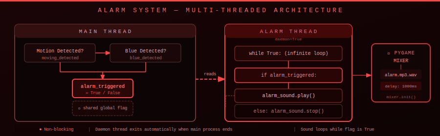
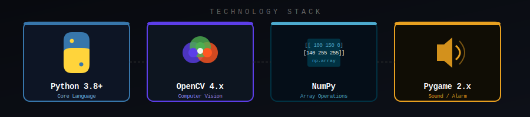
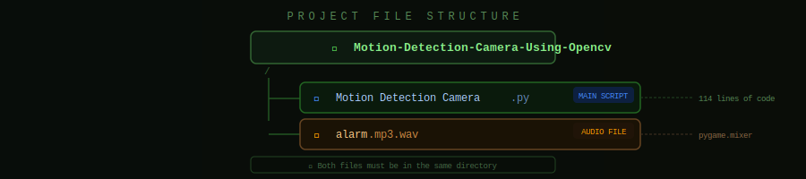

<div align="center">



[](https://www.python.org/)
[](https://opencv.org/)
[](https://www.pygame.org/)
[](LICENSE)

A real-time computer vision system that detects **motion**, **faces**, **eyes**, and **colored objects** through a live webcam feed — and triggers an **alarm sound** when activity is detected.

</div>

---

## 🖥️ Live Detection Output



> Real-time camera view with bounding boxes for faces (blue), eye regions (green), motion objects (green), and blue objects (orange).

---

## ⚙️ System Pipeline



Every frame from the webcam is split into three parallel detection branches — face/eye detection via Haar Cascades, motion detection via MOG2 background subtraction, and color detection via HSV masking — before merging into a shared `alarm_triggered` flag.

---

## 🏃 Motion Detection



The background subtractor `MOG2` builds a model of the static scene. Each new frame is compared to it — pixels that differ significantly become white in the foreground mask. Contours larger than **300px²** are wrapped in a green bounding box and trigger the alarm.

```python
fgbg = cv2.createBackgroundSubtractorMOG2()
fgmask = fgbg.apply(frame)
th = cv2.threshold(fgmask.copy(), 244, 255, cv2.THRESH_BINARY)[1]
contours, _ = cv2.findContours(th, cv2.RETR_EXTERNAL, cv2.CHAIN_APPROX_SIMPLE)
```

---

## 👤 Face & Eye Detection



OpenCV's pre-trained Haar Cascade classifiers scan each grayscale frame. A **blue rectangle** is drawn around every detected face; within each face's Region of Interest (ROI), eyes are further detected and highlighted with **green rectangles**.

```python
faces = face_cascade.detectMultiScale(gray, scaleFactor=1.1, minNeighbors=5, minSize=(30, 30))
for (x, y, w, h) in faces:
    cv2.rectangle(frame, (x, y), (x+w, y+h), (255, 0, 0), 2)   # Blue face box
    eyes = eye_cascade.detectMultiScale(roi_gray)
    # Green eye boxes drawn within ROI
```

---

## 🔵 Blue Color Detection



The frame is converted from **BGR → HSV** color space where color (hue) is independent of brightness. A binary mask isolates pixels whose hue falls in the blue range (H 100–140). Any blue contour exceeding 300px² triggers detection and an orange bounding box.

```python
hsv_frame = cv2.cvtColor(frame, cv2.COLOR_BGR2HSV)
lower_blue = np.array([100, 150, 0])
upper_blue = np.array([140, 255, 255])
blue_mask = cv2.inRange(hsv_frame, lower_blue, upper_blue)
```

---

## 🔔 Alarm System



The alarm runs on a **separate daemon thread** so it never blocks the video loop. It continuously checks the `alarm_triggered` global flag — playing `alarm.mp3.wav` in a loop when `True`, and stopping immediately when `False`.

```python
def play_alarm():
    while True:
        if alarm_triggered:
            alarm_sound.play()
            pygame.time.delay(1000)
        else:
            alarm_sound.stop()

alarm_thread = threading.Thread(target=play_alarm)
alarm_thread.daemon = True
alarm_thread.start()
```

---

## 🛠️ Technology Stack



---

## 📁 Project Structure



```
Motion-Detection-Camera-Using-Opencv/
├── Motion Detection Camera.py     # Main application — 228 lines
└── alarm.mp3.wav                  # Audio alarm file for pygame mixer
```

> ⚠️ Both files **must** be in the same directory before running the script.

---

## 🚀 Getting Started

**1. Clone the repository**
```bash
git clone https://github.com/01dhruvtripathi/Motion-Detection-Camera-Using-Opencv.git
cd Motion-Detection-Camera-Using-Opencv
```

**2. Install dependencies**
```bash
pip install opencv-python numpy pygame
```

**3. Run the application**
```bash
python "Motion Detection Camera.py"
```

Press `Q` to quit.

---

## 📊 Detection Summary

| Detection | Method | Bounding Box Color | Alarm |
|---|---|---|---|
| 🏃 Motion | MOG2 Background Subtraction | 🟢 Green | ✅ Yes |
| 👤 Face | Haar Cascade Classifier | 🔵 Blue | ❌ No |
| 👁️ Eyes | Haar Cascade (within face ROI) | 🟢 Green | ❌ No |
| 🔵 Blue Object | HSV Color Masking | 🟠 Orange | ✅ Yes |

---

## 👨‍💻 Author

**Dhruv Tripathi** — [@01dhruvtripathi](https://github.com/01dhruvtripathi)
